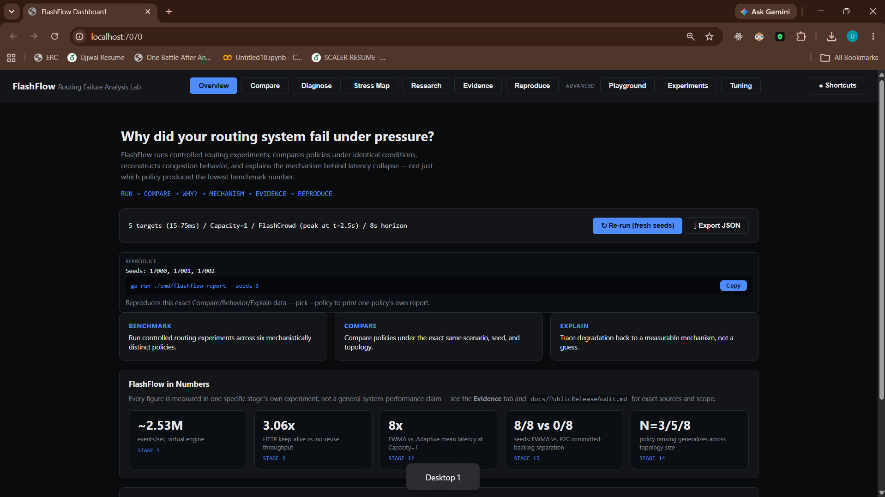
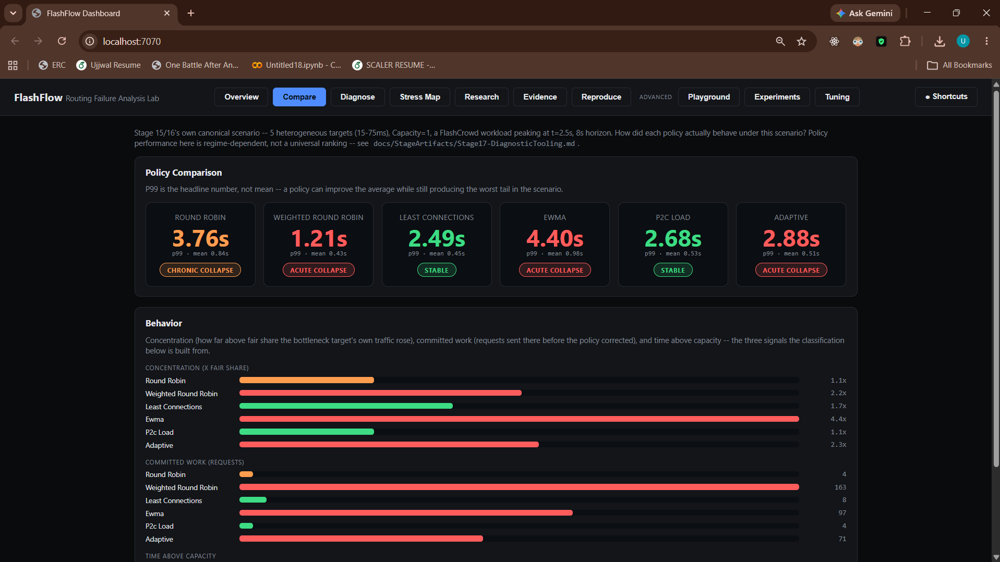
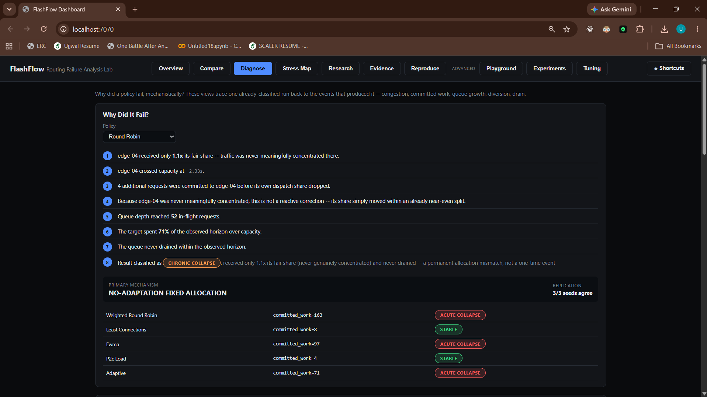
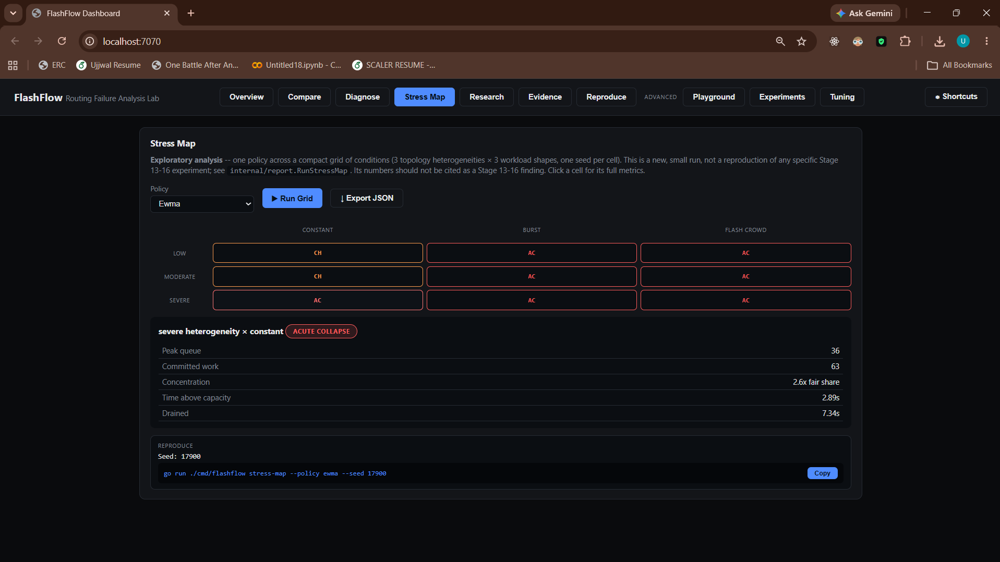

# FlashFlow

### Why did your routing system fail under pressure?

**FlashFlow is a routing failure-analysis laboratory for distributed edge systems.** It runs controlled
experiments, compares routing policies under identical conditions, reconstructs congestion and backlog
dynamics, and explains why latency collapses — not just which policy produced the lowest benchmark number.

```
RUN → COMPARE → DIAGNOSE → EXPLAIN → EVIDENCE → REPRODUCE
```

[](go.mod)
[](https://github.com/Ujjwaljain16/FlashFlow/actions/workflows/ci.yml)
[](LICENSE)

[**Try the demo**](#try-it-in-2-minutes) &nbsp;·&nbsp; [**Watch the flagship**](docs/StageArtifacts/Stage16-FlagshipDemo.md) &nbsp;·&nbsp; [**Read the research**](#research-history) &nbsp;·&nbsp; [**GitHub**](https://github.com/Ujjwaljain16/FlashFlow)

| Overview | Compare |
|---|---|
| [](docs/images/dashboard-overview.png) | [](docs/images/dashboard-compare.png) |

| Diagnose | Stress Map |
|---|---|
| [](docs/images/dashboard-diagnose.png) | [](docs/images/dashboard-stressmap.png) |

*Live dashboard (`go run ./cmd/dashboard`) — every number shown is computed by `internal/report`, not hand-authored.*

---

## Why FlashFlow?

Distributed routing failures are hard to diagnose because several variables change at once: traffic,
capacity, latency, failures, and cache state all shift together, and a single aggregate latency number
can't tell you which one mattered.

A typical benchmark answers: *"Policy A was faster."* FlashFlow asks: *"Why did Policy A fail?"*

```
traffic → concentration → capacity pressure → committed work / chronic over-allocation
        → queue behavior → tail latency
```

FlashFlow holds everything exogenous (traffic, topology, failures, seed) fixed, lets each policy evolve
its own routing decisions on top of that identical world, and reconstructs — from the raw dispatch and
completion events — exactly where and why one policy's queues grew and another's didn't.

## What makes it different?

| Typical benchmark | FlashFlow |
|---|---|
| Compares final latency | Compares behavior and mechanism |
| Separate runs per policy | Counterfactual same-world comparison |
| Produces a leaderboard | Produces a failure diagnosis |
| Aggregate metrics only | Event-level queue/backlog reconstruction |
| One workload | Controlled workload × topology × failure matrix |
| Declares a "winner" | Reports evidence, limitations, and a reproduction command |

This describes FlashFlow's own workflow, not a claim about any other specific tool.

## Try it in 2 minutes

```bash
go run ./cmd/flashflow report --policy ewma
go run ./cmd/flashflow explain --policy ewma <the report JSON the command above just wrote>
go run ./cmd/flashflow stress-map --policy least-connections
```

Or browse it interactively:

```bash
go run ./cmd/dashboard
```

Or reproduce the flagship result end to end (5 heterogeneous targets, Capacity=1, a FlashCrowd workload,
3 independent seeds):

```bash
./scripts/reproduce-flagship.sh
```

`scripts/*.sh` need Git Bash or WSL on Windows — a plain `cmd.exe`/PowerShell prompt won't run them.

## Diagnose a failure

```bash
$ go run ./cmd/flashflow report --policy ewma
FLASHFLOW FAILURE REPORT
---------------------------------------

Scenario
5 targets (15-75ms) / Capacity=1 / FlashCrowd (peak at t=2.5s) / 8s horizon

Policy: ewma

Diagnostic classification
ACUTE_COLLAPSE
(concentrated overload that had not, or had only just, resolved)

Peak queue                   95
Committed work               97
...
Primary mechanism
SMOOTHED-HISTORY LOCK-IN
```

```bash
$ go run ./cmd/flashflow explain --policy ewma <report.json>
WHY DID THIS POLICY COLLAPSE?

1. Traffic concentrated on edge-02 (4.4x its fair share).
2. edge-02 crossed capacity at 2.488s.
3. EWMA continued routing traffic to edge-02, committing 97 additional
   requests before its dispatch share materially dropped.
4. The policy began diverting new traffic at 2.698s.
...
Counterfactual (same scenario, same seeds, different policy):
  round-robin            committed_work=4     classification=CHRONIC_COLLAPSE
  least-connections      committed_work=8     classification=STABLE
```

`report`/`explain`/`stress-map` all support `--json` for scripting and their own `--help`. The
classifier's two magnitude constants (concentration ≥1.2× fair share, committed work ≥10× capacity) were
iteratively calibrated to match Stage 15/16's own six already-published policy outcomes (the two-mechanism
model described below, in **The key research finding**) — a genuine internal-consistency check, not an
independently-derived or externally-validated threshold. **Diagnostic thresholds are heuristic calibration
parameters, not universal system thresholds.** See
[Stage17-DiagnosticTooling.md](docs/StageArtifacts/Stage17-DiagnosticTooling.md) for exactly how, and
three real classifier bugs that calibration caught. `stress-map`'s own grid is a small, **exploratory**
run — its numbers are not a Stage 13-16 finding.

## The key research finding

Under finite capacity, concentration alone doesn't explain collapse — FlashFlow's experiments found
evidence for at least two distinct failure shapes:

```
ACUTE COLLAPSE                          CHRONIC COLLAPSE
concentration                           structural over-allocation
    ↓                                        ↓
continued commitment                    sustained time above capacity
    ↓                                        ↓
committed backlog                       persistent queue pressure
    ↓                                        ↓
tail collapse                           tail collapse
```

Committed backlog (work already dispatched to a target between the moment it congests and the moment a
policy materially diverts new work elsewhere): in the tested topology-size generalization, this was the
strongest available retrospective severity measure for acute collapse; sustained time-above-capacity is
more informative for chronic collapse. **No single scalar metric was found that explains both** — and committed backlog itself is a *retrospective* statistic: it's
computed by anchoring its counting window to whichever congestion episode turns out to contain the run's
peak depth, which requires already having seen that episode's own future. It's a faithful, correct
post-hoc explanation, not something a live system could compute as events arrive.

Full evidence ledger: [Stage16-ClaimLedger.md](docs/StageArtifacts/Stage16-ClaimLedger.md). Full
narrative: [Stage16-ResearchSynthesis.md](docs/StageArtifacts/Stage16-ResearchSynthesis.md).

## The most important negative result

**Adaptive does not always win.** In the canonical flagship scenario (5 heterogeneous targets,
Capacity=1, FlashCrowd), Adaptive's own P99 was worst-of-six in two of three independent seeds, and a
statistical near-tie with EWMA (within 0.3%) in the third — never among the safer half of six policies in
any seed tested — despite a comparatively strong mean latency. A controlled ablation traced its resistance
to collapse specifically to its Load signal, not general "smartness."

That negative result was useful: mean latency alone would have hidden it, and it's what motivated moving
from "which policy wins?" to "what mechanism caused the tail failure?" — the entire premise of this
project's diagnostic tooling.

## FlashFlow in numbers

Every figure below is measured in one specific stage's own experiment, not a general performance claim.

| Measurement | Value | Measured in |
|---|---|---|
| Virtual-time engine throughput | ~2.53M events/sec | [Stage 5](docs/StageArtifacts/Stage5.md) |
| HTTP keep-alive vs. no-reuse throughput | 3.06× | [Stage 2](docs/StageArtifacts/Stage2.md), at concurrency=100 |
| EWMA vs. Adaptive mean latency at Capacity=1 | 8× (Cliff's Delta=1.000, 12 seeds) | [Stage 12](docs/StageArtifacts/Stage12.md) |
| P2C vs. EWMA committed-backlog separation | 8/8 seeds vs. 0/8 seeds | [Stage 15](docs/StageArtifacts/Stage15.md), claim C25 |
| Topology-size generalization | Rank ordering holds across N=3/5/8; the raw ρ threshold does not | [Stage 14](docs/StageArtifacts/Stage14.md) |

## How it works

1. **Define a scenario** — topology, workload, capacity, failure schedule.
2. **Run policies** — each under identical exogenous conditions.
3. **Capture the event stream** — dispatch, completion, and state-transition events.
4. **Compare outcomes** — latency, queue depth, committed backlog, recovery.
5. **Diagnose the mechanism** — acute collapse / chronic collapse / stable / recovery-limited.
6. **Reproduce** — exact configuration, seed, and command.

## Architecture

FlashFlow's core capabilities, compactly:

```
                    FlashFlow
                        │
          ┌─────────────┴─────────────┐
          │                           │
   Virtual-Time Engine         Real HTTP Engine
   (deterministic)             (net/http + internal/netsim)
          │                           │
          └─────────────┬─────────────┘
                         ↓
                Experiment Engine
                         ↓
           Trace / Metrics / Results
                         ↓
              Statistics / Replay
                         ↓
             Diagnostics / Reports
```

| Component | Purpose |
|---|---|
| Virtual Time (`internal/vtime`, `internal/replay`) | Deterministic discrete-event experiments |
| Real Engine (`internal/engine/real.go`) | Real Go `net/http` execution, in-process network degradation |
| Routing (`internal/proxy/`) | Six mechanistically distinct policy implementations |
| Replay (`internal/replay`) | Same-world counterfactual comparison |
| Backlog (`internal/backlog`) | Queue/congestion reconstruction |
| Statistics (`internal/statistics`) | Percentiles, effect sizes, confidence intervals |
| Tuning (`internal/tuning`) | Parameter search with development/holdout validation |
| Dashboard (`cmd/dashboard`) | Interactive experiment exploration |
| Diagnostics (`cmd/flashflow`, `internal/report`) | report / explain / stress-map |

Six routing policies, each mechanistically distinct: round-robin (no signal), weighted-round-robin
(static weights), least-connections (current in-flight count), EWMA (smoothed latency history), P2C
(sampled comparison of two random targets), and Adaptive (a weighted combination of **four** scored
signals — Load, Latency, Cache, Cost).

## Same world, different policy

FlashFlow's counterfactual replay holds the exogenous world fixed — arrivals, failures, topology, seed —
while each policy evolves its own independent endogenous state (queue depths, cache contents).

```
same traffic, topology, failures, seed
              ↓
      policy A     policy B
              ↓         ↓
   independent state evolution
              ↓
     first point of divergence
```

Confirmed via full-trace identity/divergence tests: two policies replayed against the identical trace
diverge only after their own decisions actually differ, not before.

## Evidence, not just benchmarks

Every reported result carries its configuration, seed, result artifact, and reproduction command —
findings are meant to be checked, not taken on faith:

- [Stage16-ClaimLedger.md](docs/StageArtifacts/Stage16-ClaimLedger.md) — every strong claim with its exact
  evidence and status (supported / limited / retired)
- [Stage16-ResearchSynthesis.md](docs/StageArtifacts/Stage16-ResearchSynthesis.md) — the full narrative
- [PublicReleaseAudit.md](docs/PublicReleaseAudit.md) — an independent repository/claims/security audit

## Reproducibility

The repository was cloned into an isolated clean directory at the release commit: `go build ./...`
succeeded, `go test ./...` passed across all 23 packages, and `./scripts/reproduce-flagship.sh` reproduced
the flagship result byte-for-byte identical except the timestamp field.

```bash
go test ./...
go build ./...
./scripts/final-validation.sh      # formatting, vet, tests, deterministic replay, statistical/tuning gates
./scripts/reproduce-flagship.sh    # the flagship demonstration, 3 independent seeds
```

This holds for the **virtual engine**. The real engine is subject to genuine OS scheduling and wall-clock
timing noise — its results are directionally, not byte-for-byte, reproducible, and disclosed as such
rather than hidden.

## Limitations

- The finite-capacity model is a single FIFO queue per target, not a real multi-resource scheduler.
- Committed backlog is a retrospective severity measure, not something a live system could compute online.
- Cross-workload-shape generalization of committed backlog is imperfect (real, but not perfect, rank
  agreement).
- The cache-affinity interim-latency mechanism remains unresolved.
- No cross-hardware determinism guarantee — "deterministic" means same machine, same Go toolchain, same
  seed.
- The real engine has genuine OS/timing variance; a validated concurrency ceiling reproduces the
  mechanism's direction at most, not all, tested overload levels.
- Most experiment binaries after Stage 10 (the last stage to focus on system-building rather than
  research) write ad hoc result JSON rather than a full provenance manifest.
- Never run against real production traffic.

## What FlashFlow is not

Not a production CDN, a replacement for Envoy/NGINX/HAProxy, a complete packet-level network simulator
(ns-3, Mininet), a universal routing optimizer, or a proof that Adaptive always wins. Doubly Robust
Off-Policy Evaluation, contextual bandits/RL, real `tc netem`/Kubernetes orchestration, and OpenTelemetry
were evaluated and are explicitly **not implemented** — see
[Stage16-ScopeFreeze.md](docs/StageArtifacts/Stage16-ScopeFreeze.md).

## Research history

FlashFlow's research story is a sequence of increasingly precise hypotheses: later experiments repeatedly
narrowed or falsified earlier explanations, rather than confirming a single thesis from the start.

Stages 1-10 built the system itself (raw TCP, HTTP reverse proxying, six routing policies, caching and
failure injection, the virtual-time engine, statistics, counterfactual replay, tuning, and the dashboard —
see [`docs/StageArtifacts/`](docs/StageArtifacts/) for each). The research program proper:

| Stage | Question | Finding |
|---|---|---|
| [11](docs/StageArtifacts/Stage11.md) | Does Adaptive routing beat simpler policies under heterogeneity? | An 8-program sweep found Adaptive never wins outright on raw mean latency in a flat (no-queueing) model — the model had no way to penalize EWMA's unconstrained concentration. |
| [12](docs/StageArtifacts/Stage12.md) | Does a minimal finite-capacity model change the answer? | Reverses sharply: at Capacity=1, EWMA's mean latency explodes 8× while Adaptive barely moves (12-seed confirmation). |
| [13](docs/StageArtifacts/Stage13.md) | What actually drives the Stage 12 reversal? | Locates it at offered ρ≈0.89-0.97; reframes the boundary as "load-blind vs. load-aware routing." |
| [14](docs/StageArtifacts/Stage14.md) | Does that boundary hold as the topology scales? | Falsified: EWMA (load-aware by Stage 13's classification) loses outright to round-robin at N=8. |
| [15](docs/StageArtifacts/Stage15.md) | If not rho, what explains collapse? | Direct backlog measurement reveals two distinct collapse shapes — see **The key research finding** above. |
| [16](docs/StageArtifacts/Stage16.md) | Is the evidence solid enough to freeze and release? | Re-audited every strong claim against source, fixed a real security gap, confirmed clean-checkout reproducibility. |
| [17](docs/StageArtifacts/Stage17-DiagnosticTooling.md) | Can the Stage 15/16 model become something an engineer runs directly? | `flashflow report`/`explain`/`stress-map` — productizes the research; adds no new claim. |

Per-stage experiment commands, detailed methodology, and the full correction history live in each linked
artifact and in [`docs/learning/`](docs/learning/).

## Project status

All 17 stages are complete. Verdict: **ready with documented limitations** — see
[Stage16.md](docs/StageArtifacts/Stage16.md) for the full release audit.

## License

MIT — see [LICENSE](LICENSE). See [SECURITY.md](SECURITY.md) to report a concern.
